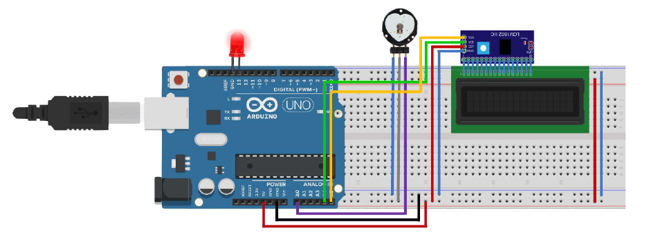
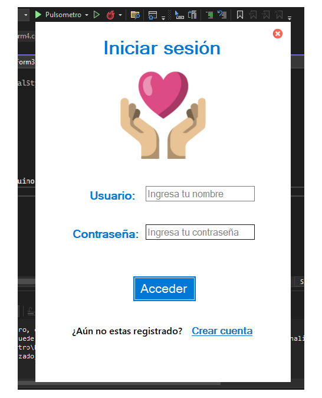
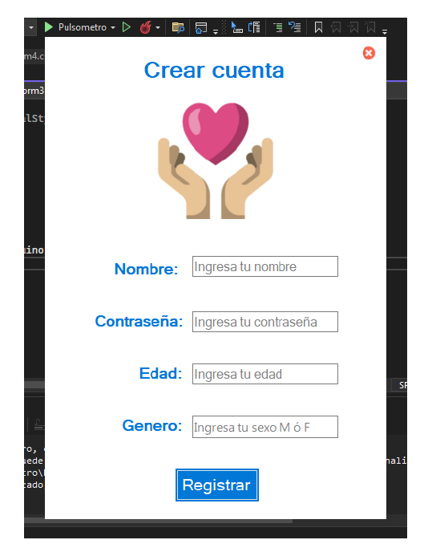
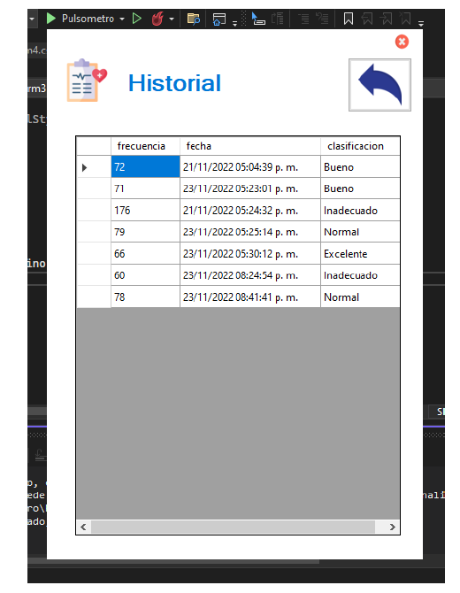

# Sensor de Pulso con Arduino y Tecnología .net

## Descripción
Este proyecto permite registrar y analizar el ritmo cardíaco de un paciente, con el objetivo de **identificar posibles anomalías y predecir futuros problemas cardíacos**.  
El sistema mantiene un registro de los datos, lo que facilita el **seguimiento médico y la toma de decisiones clínicas**.  
Además, integra tecnología **.NET** para el desarrollo de la aplicación de gestión de datos, permitiendo una interfaz intuitiva y una comunicación eficiente entre el hardware (Arduino) y el sistema de monitoreo.  

## 🧰 Materiales
• 1 Arduino UNO
• 1 I2C LCD
• 1 LCD 16x2
• 1 pulsómetro
• 1 protoboard 830
• 15 cables M-M
• 15 cables H-M

## 📸 Diagramas

  
  
  
  
  

