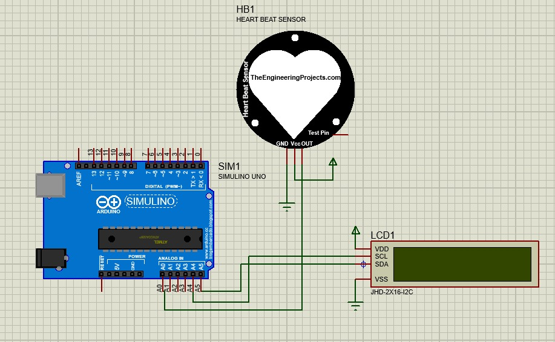

# IoT Full-Stack Health Monitor | Arduino & .NET

An end-to-end medical IoT system designed to monitor, store, and process real-time cardiac data. The project features an Arduino-based firmware utilizing hardware timer interrupts to sample biomedical data, alongside a desktop .NET client application engineered for data visualization, historical storage, and printable report generation.

---

## 🛠️ System Architecture & Components

* **Microcontroller:** Arduino Uno / ATmega328P.
* **Biomedical Hardware:** Optical Heart Rate Pulse Sensor.
* **Display Interface:** 16x2 LCD Module with an I2C backpack interface (PCF8574).
* **Software Interface:** .NET Desktop Application (C# UI integration, Serial Data Parser, Reporting Engine).
* **Communication Bus:** UART Serial Communication at 9600 Baud.

---

## 📐 Circuit Layout & Hardware Schematic

The embedded hardware processes analog signals from the heart rate sensor while driving an LCD over the I2C bus via pins `A4` (SDA) and `A5` (SCL):

  

---

## 💻 Embedded Firmware Key Features (Arduino)

The firmware is written in native **C/C++** and stands out due to its low-level hardware control and signal processing approach:

* **Hardware Timer Interrupts:** Configures the internal **Timer2** in CTC (Clear Timer on Compare Match) mode via direct register manipulation (`TCCR2A/B`, `OCR2A`). It triggers an Interrupt Service Routine (**ISR**) strictly every 2ms (500Hz sample rate) for deterministic analog reading.
* **Signal Processing & Noise Mitigation:** The `ISR(TIMER2_COMPA_vect)` dynamically tracks wave peaks and troughs (`P` and `T` algorithms) to calculate the Inter-Beat Interval (IBI), mitigating high-frequency and dicrotic notch noise.
* **Real-time Metrics:** Computes a running average of the last 10 valid IBI values to output a stable and reliable Beats Per Minute (BPM) rate over Serial and the local I2C LCD display.

---

## 🖥️ .NET Application Interface (UI/UX)

The companion desktop application acts as the data management platform, receiving raw metrics via serial communication to visualize telemetry data and manage patient records.

  
  

  
  

---

## ⚙️ Microcontroller Register & Pin Reference

### Hardware Registers Configured (Timer2)
* `TCCR2A = 0x02;` -> Disables PWM on Digital Pins 3/11 and forces CTC Mode.
* `TCCR2B = 0x06;` -> Sets a 256 clock prescaler factor.
* `OCR2A = 0X7C;`  -> Sets top counter limit to 124, establishing the 500Hz interrupt cycle.
* `TIMSK2 = 0x02;` -> Enables interrupt execution on match.

### Physical I/O Mapping
| Peripheral Component | Connection Type | Arduino Uno Pin | Function / Description |
|---|---|---|---|
| Pulse Sensor | Analog Input | `A0` | Collects raw optical PPG waveform voltages |
| LCD I2C - SDA | Digital I/O | `A4` | Serial Data Line for I2C communication |
| LCD I2C - SCL | Clock Output | `A5` | Serial Clock Line for I2C communication |
| Onboard Status LED | Digital Output | `D13` | Actuates dynamically during real-time pulse peaks |
